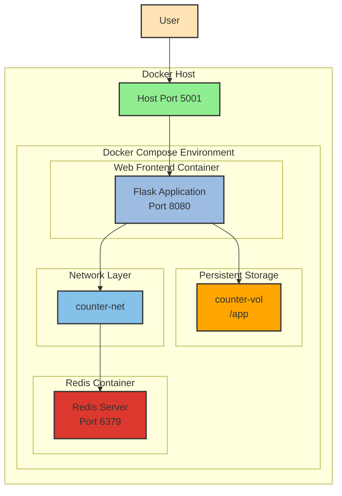

# 🐳 Multi-Container Application Deployment with Docker Compose

[](https://github.com/TheToriqul/multi-container-app-deployment)


## 📋 Project Overview

This project demonstrates my expertise in deploying and managing multi-container applications using Docker Compose. I've built a scalable web application that combines a Python Flask frontend with a Redis backend, showcasing modern containerization practices and microservices architecture.

## 🎯 Key Objectives

- Implement a multi-container application architecture using Docker Compose
- Develop a Flask web application with Redis integration for state management
- Configure container networking for secure service communication
- Implement persistent storage using Docker volumes
- Create a production-ready container deployment workflow

## 🏗️ Project Architecture



## 💻 Technical Stack

- **Frontend**: Python Flask application
- **Backend**: Redis for data persistence
- **Container Runtime**: Docker Engine
- **Orchestration**: Docker Compose
- **Base Images**: 
  - Python 3.9 Alpine
  - Redis Alpine

## 🚀 Getting Started

<details>
<summary>🐳 Prerequisites</summary>

- Docker Engine (version 20.10.0 or higher)
- Docker Compose V2
- Git (for cloning the repository)
- curl (for testing the deployment)

</details>

<details>
<summary>⚙️ Installation</summary>

1. Clone the repository:
   ```bash
   git clone https://github.com/TheToriqul/multi-container-app-deployment.git
   cd multi-container-app-deployment
   ```

2. Review the configuration files:
   - `app.py`: Flask application code
   - `Dockerfile`: Container image definition
   - `compose.yaml`: Multi-container orchestration configuration

3. Deploy the application:
   ```bash
   docker compose -f compose.yaml up -d
   ```

</details>

<details>
<summary>🎮 Usage</summary>

1. Access the application:
   ```bash
   curl localhost:5001
   ```

2. Monitor the services:
   ```bash
   docker-compose ps
   docker-compose logs
   ```

3. Stop the application:
   ```bash
   docker-compose down --volumes
   ```

For detailed commands and operations, refer to the [reference-commands.md](reference-commands.md) file.

</details>

## 💡 Key Learnings

### Technical Mastery:

1. Docker Compose configuration and service orchestration
2. Container networking and inter-service communication
3. Volume management for persistent storage
4. Multi-stage builds and image optimization
5. Service discovery and load balancing

### Professional Development:

1. Microservices architecture design
2. Infrastructure as Code (IaC) practices
3. DevOps workflow optimization
4. System debugging and troubleshooting
5. Documentation and technical writing

## 🔄 Future Enhancements

<details>
<summary>View Planned Improvements</summary>

1. Implement Docker Swarm for container orchestration
2. Add Nginx reverse proxy for load balancing
3. Implement health checks and automatic container recovery
4. Add monitoring with Prometheus and Grafana
5. Implement CI/CD pipeline with GitHub Actions
6. Add automated testing framework

</details>

## 🙌 Contribution

Contributions are welcome! Feel free to [open an issue](https://github.com/TheToriqul/multi-container-app-deployment/issues) or submit a [pull request](https://github.com/TheToriqul/multi-container-app-deployment/pulls).

## 📧 Connect with Me

- 📧 Email: toriqul.int@gmail.com
- 📱 Phone: +65 8936 7705, +8801765 939006
- 🌐 LinkedIn: [@TheToriqul](https://www.linkedin.com/in/thetoriqul/)
- 🐙 GitHub: [@TheToriqul](https://github.com/TheToriqul)
- 🌍 Portfolio: [TheToriqul.com](https://thetoriqul.com)

## 👏 Acknowledgments
- [Poridhi for providing comprehensive labs and inspiring this project](https://devops.poridhi.io/) 
- The Docker and Docker Compose communities for their excellent documentation
- The Flask and Redis teams for their robust and reliable technologies
- The open-source community for continuous inspiration and learning resources

---

Thank you for exploring this project! I hope it demonstrates my practical experience with container orchestration and microservices architecture. Feel free to reach out if you have any questions or would like to discuss collaboration opportunities! 🚀